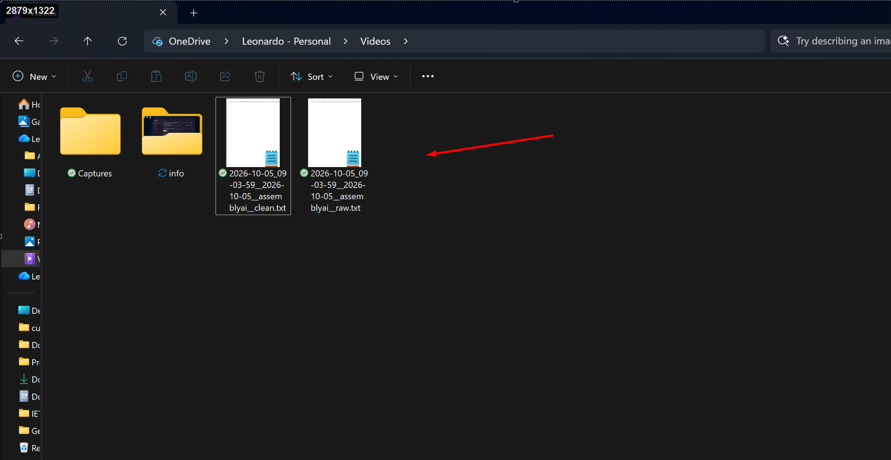
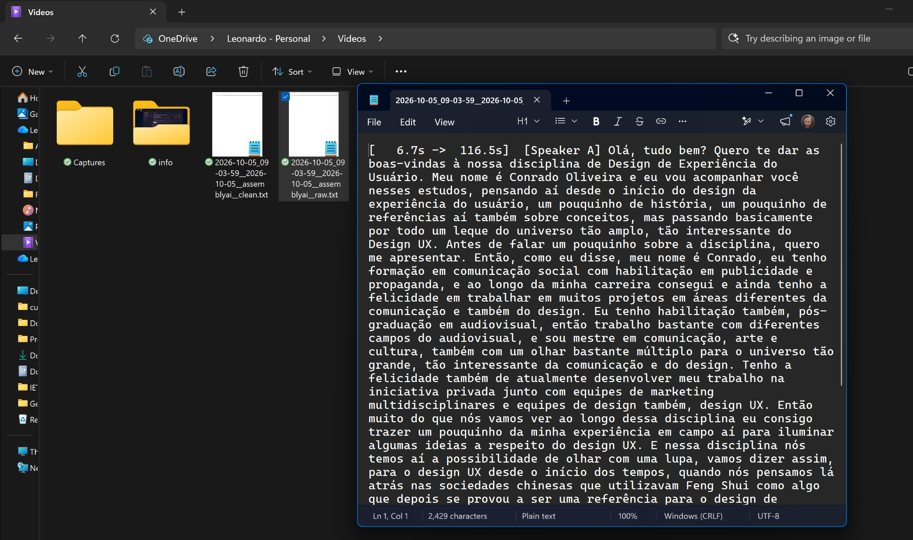

# UpexNote

> Transcreva, organize e explore suas conversas.

UpexNote é o produto local-first de transcrição, contexto e estudo do ecossistema UpexFlow. A aplicação está em evolução contínua e já avançou além de parte da documentação e dos materiais visuais atualmente disponíveis neste repositório.

Hoje o UpexNote já reúne, numa única aplicação Windows, uma cadeia completa que vai da transcrição ao estudo e à reutilização do conteúdo:

- transcrição de áudio e vídeo com múltiplos motores, preservação separada de `raw` e `clean` e validações/benchmarks próprios de qualidade, custo, latência e diarização;
- **Prévia estruturada** para transformar o transcript em conteúdo organizado e legível, preservando a origem e o processamento utilizado;
- **Caderno (Notebooks)** com árvore de projetos/pastas/cadernos/seções, notas editáveis, anotações, comentários, referências, links entre notas, glossário/dicionário e exportação em `.md`, `.docx` e pacote de contexto/prompt para outras IAs;
- **Administration** com Users, Activity, Audit, Telemetry, Support e **Data Studio**, incluindo catálogo PostgreSQL, Visual Builder, SQL Editor, Saved Queries, consultas parametrizadas, mutações protegidas e diagramas ER;
- identidade e segurança com e-mail/senha, Google, GitHub, recuperação de senha, MFA administrativo, proteção de credenciais e telemetria consentida sem conteúdo privado;
- experiência de produto com temas, tipografia, densidade, zoom, acessibilidade, responsividade e interface em PT/EN/ES.

O fluxo principal já permite partir de uma transcrição, gerar uma prévia formatada, levar o conteúdo para o Caderno, editar e estudar o material e exportá-lo para uso externo ou continuidade em outras ferramentas de IA.

## Veja o UpexNote em uso

### Demonstração do usuário · 1 min 36 s

Do conteúdo original ao material de estudo: o vídeo percorre a transcrição com escolha de motor, a Biblioteca, a geração de uma Prévia estruturada e o Caderno editável, além da exportação, das preferências e das opções de segurança, com legendas pontuais e trechos acelerados (sinalizados no vídeo).

https://github.com/user-attachments/assets/05e21e98-199f-4ca4-a918-dd9bd62a5e38

A aplicação está em evolução e refinamento contínuos, com outras funcionalidades em desenvolvimento. Esta demonstração registra o fluxo disponível em outubro de 2026.

### Demonstração administrativa · acesso restrito · 1 min 51 s

O perfil administrador também utiliza os recursos do usuário e conta com controles adicionais de segurança, registros de atividade, suporte e Data Studio. **O acesso à área administrativa é restrito a contas autorizadas.**

https://github.com/user-attachments/assets/8aa30273-ce92-40df-be98-ac86d3ce65bb

Os vídeos demonstram o estado atual do projeto. A publicação do código e dessas demonstrações não implica disponibilização pública da aplicação nem acesso à infraestrutura administrativa.

### Transcrições salvas automaticamente: RAW e clean

Ao concluir a transcrição, o UpexNote salva separadamente dois arquivos `.txt`:

- **RAW:** preserva o resultado original do motor, como referência imutável. Quando fornecidos pelo motor, inclui marcações de tempo e identificação de falantes.
- **clean:** mantém uma versão derivada para leitura e organização do conteúdo, sem substituir o RAW.

O destino fica sob controle do usuário. Nas **preferências de armazenamento**, é possível definir a pasta padrão e ativar a organização em subpastas por **data e motor**. Também é possível escolher outra pasta para uma transcrição específica; nesse caso, os arquivos são salvos diretamente no destino escolhido.

Os nomes identificam a **origem, a data, o motor e o tipo**, mesmo quando todos os arquivos ficam em uma única pasta:

```text
nome_do_arquivo__2026-10-05__assemblyai__raw.txt
nome_do_arquivo__2026-10-05__assemblyai__clean.txt
```

**Exemplo real dos arquivos RAW e clean salvos lado a lado:**



**RAW aberto em um editor de texto, com marcações de tempo e falante:**



Os arquivos permanecem acessíveis na pasta escolhida e podem ser abertos fora da aplicação. O envio de conteúdo a motores de IA depende da escolha explícita do usuário. Se o destino escolhido estiver sincronizado com um serviço de nuvem, os arquivos também seguem as configurações desse serviço.

> **Nota sobre a documentação:** alguns documentos, capturas de tela e materiais visuais ainda refletem versões anteriores da aplicação. A documentação técnica e visual será atualizada progressivamente para acompanhar o estado mais recente do produto.

## Estado atual

O produto já possui uma aplicação Windows instalada e validada, não apenas uma fundação ou protótipo. Estão entregues:

- transcrição de ficheiros de áudio e vídeo com múltiplos motores;
- preservação separada de transcript `raw` e conteúdo `clean` derivado;
- Biblioteca por utilizador, pesquisa, edição do clean, avisos, histórico e auditoria;
- identidade por e-mail/senha, Google e GitHub, recuperação de senha e MFA administrativo;
- administração hierárquica com Users, Activity, Audit, Telemetry, Support e Data Studio;
- telemetria opcional e anónima, sem conteúdo;
- suporte com chamados, comentários, estados, atribuições e evidências;
- Data Studio com catálogo, Visual Builder, SQL Editor, Saved Queries e diagramas ER;
- temas, densidade, tipografia, zoom e interface em PT/EN/ES.

O estado validado, o backlog imediato e o histórico de decisões vivem em [`docs/PROJECT_CONTEXT.md`](docs/PROJECT_CONTEXT.md).

## Arquitetura resumida

```text
Desktop Tauri + React + TypeScript
              │ comandos Rust + eventos NDJSON
              ▼
Worker Python local empacotado como sidecar
  ├─ mídia, transcrição e armazenamento local
  ├─ Windows Credential Manager
  ├─ SQLite embutido
  └─ PostgreSQL administrativo por túnel SSH

API central FastAPI /v1 por HTTPS
  ├─ recuperação de senha e MFA
  ├─ tokens e telemetria consentida
  └─ suporte
              │
              ▼
PostgreSQL no EasyPanel/VPS
```

## Princípios obrigatórios

- Vídeo bruto permanece no local de origem e nunca é copiado automaticamente.
- Áudio só é enviado a um motor cloud após escolha explícita do utilizador.
- O transcript bruto é imutável; limpeza, edição, resumo, formatação e estudo são derivados identificados.
- Credenciais ficam no Windows Credential Manager ou em variáveis protegidas dos serviços; nunca no Git, em logs ou argumentos.
- Arquivos locais são preservados primeiro; falhas de serviços centrais não podem apagar ou bloquear o resultado local.
- Novos domínios PostgreSQL usam schemas separados e nomeados em inglês.
- UI/UX, acessibilidade, temas, estados e responsividade são requisitos arquiteturais.
- Administração usa menu lateral hierárquico, não abas horizontais como navegação principal.

## Estrutura

- `apps/desktop` — aplicação Tauri 2, React 19 e TypeScript.
- `services/worker` — sidecar Python, motores, identidade local, Biblioteca e Data Studio.
- `services/api` — API central FastAPI para identidade, MFA, telemetria, tokens e suporte.
- `ops/vps` — scripts versionados de backup, firewall e arquivo de evidências.
- `docs` — arquitetura, produto, UX, contexto vivo e ideias futuras.
- `storage` — conteúdo gerado pelo utilizador; ignorado pelo Git.

## Fonte de verdade e continuidade

Ler nesta ordem antes de alterar o projeto:

1. código e estado real do Git;
2. [`AGENTS.md`](AGENTS.md);
3. [`docs/PROJECT_CONTEXT.md`](docs/PROJECT_CONTEXT.md);
4. documentos arquiteturais específicos — para Cadernos, [`docs/NOTEBOOK_ARCHITECTURE.md`](docs/NOTEBOOK_ARCHITECTURE.md);
5. [`docs/UX_PRODUCT_STANDARD.md`](docs/UX_PRODUCT_STANDARD.md);
6. [`docs/FUTURE_PRODUCT_IDEAS.md`](docs/FUTURE_PRODUCT_IDEAS.md) e [`docs/AI_MEDIA_EVOLUTION.md`](docs/AI_MEDIA_EVOLUTION.md) apenas como possibilidades futuras.

Para continuidade entre contas ou agentes, consultar também [`docs/ACCOUNT_CONTINUITY_HANDOFF.md`](docs/ACCOUNT_CONTINUITY_HANDOFF.md).
