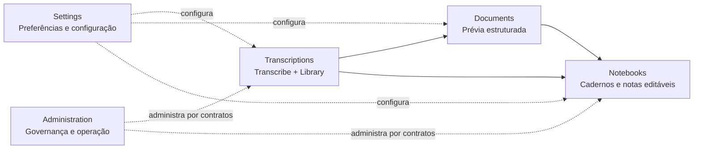

# Arquitetura do UpexNote

> Estado alinhado à versão desktop `0.30.0`. O histórico detalhado, decisões e validações vivem em `PROJECT_CONTEXT.md`.

## Visão geral

O UpexNote é uma aplicação **local-first**: a experiência principal vive no desktop do utilizador, enquanto serviços centrais suportam identidade, administração, telemetria consentida e atendimento. O material bruto continua sob controlo da máquina do utilizador.

```text
Desktop UpexNote (Tauri + React + TypeScript)
        |
        | comandos Rust + eventos NDJSON
        v
Worker local Python (sidecar)
  ├─ seleção e leitura de ficheiros locais
  ├─ extração temporária de áudio e transcrição
  ├─ Windows Credential Manager
  ├─ SQLite local ou PostgreSQL por túnel SSH
  └─ futuros: captura WASAPI e fluxos de contexto/estudo

API central FastAPI (/v1, HTTPS)
  ├─ recuperação de senha e MFA administrativo
  ├─ telemetria anónima com opt-in
  ├─ tokens de instalação
  └─ suporte
        |
        v
PostgreSQL no EasyPanel
  ├─ dados de transcrição e identidade
  ├─ schema `support` isolado para atendimento
  └─ schema `data_studio` para consultas salvas e execuções
```

O Data Studio administrativo explora o catálogo e oferece um construtor visual PostgreSQL protegido, SQL Editor manual, Saved Queries parametrizadas e diagramas ER, conforme `DATA_STUDIO_ARCHITECTURE.md`. Valores são parametrizados; mutações exigem plano confirmado, transação e auditoria. Scheduler, jobs, eventos, entregas e integrações externas permanecem posteriores à v0.28.

## Prateleiras e domínios

O UpexNote evolui como **monólito modular organizado por prateleiras**. Uma prateleira é um bounded context de produto: possui responsabilidade, navegação, contratos, permissões e ciclo de vida próprios. Isso não obriga processo, serviço ou schema exclusivo quando o domínio não precisa de persistência central.



| Prateleira | Limite | Persistência |
| --- | --- | --- |
| Transcriptions | ingestão, raw, clean, métricas, problemas e catálogo da Library | domínio existente de transcrição |
| Documents | transformação do clean, gate raw↔clean, perfis, blocos e prévias estruturadas | schema PostgreSQL `documents` |
| Notebooks | hierarquia, edição, notas, marcações, referências, chats e exportação | futuro schema PostgreSQL `notebooks` |
| Settings | aparência, tipografia, layout, paths, motores, credenciais, privacidade e segurança | local por padrão; central apenas quando necessário |
| Administration | identidade administrativa, auditoria, telemetria, Support e Data Studio | schemas proprietários dos respetivos domínios |

Menu e schema não têm relação obrigatória de um para um. `Administration`, por exemplo, agrega `support` e `data_studio` sem misturá-los. O mesmo princípio permite que `Settings` organize várias preferências sem criar um schema artificial.

A direção aprovada de navegação agrupa `Transcribe` e `Library` sob o pai `Transcriptions`, cria `Notebooks` como prateleira principal e transforma `Settings` num pai com destinos estáveis para Appearance, Typography, Layout, Storage, Engines, Privacy, Account e Security. A árvore de projetos/cadernos/notas pertence ao workspace interno de `Notebooks`, não ao menu global.

O contrato completo de Cadernos, incluindo hierarquia, fronteira com `documents`, objetos lógicos, linhagem, âncoras e fatias, vive em `NOTEBOOK_ARCHITECTURE.md`. A direção está aprovada, mas não foi implementada na v0.30.0.

## Aplicação desktop

- **UI:** React 19, TypeScript e Vite, empacotados em Tauri 2 para Windows.
- **Shell nativo:** Rust expõe comandos assíncronos para o worker, evita bloquear a janela e mantém o túnel SSH persistente quando aplicável.
- **Worker:** Python empacotado com PyInstaller como sidecar; comunica progresso e resultado por NDJSON, sem servidor HTTP local, portas ou CORS. O protocolo serializa Unicode com escapes ASCII para não depender da página de código do console Windows; o consumidor recupera os caracteres originais ao decodificar o JSON.
- **Persistência local:** cada instalação pode usar SQLite embutido; a instalação administrativa também pode usar PostgreSQL pela ligação protegida já configurada.
- **Identidade:** e-mail/senha, Google OAuth e GitHub Device Flow; administração exige elevação MFA por TOTP ou código por e-mail.

## Serviços centrais

`services/api` é uma API FastAPI publicada exclusivamente por HTTPS. O PostgreSQL não é exposto para clientes da aplicação; a API usa a rede interna do EasyPanel.

- Recuperação de senha usa códigos e tokens de uso único guardados somente como hash.
- MFA administrativo usa sessões opacas revogáveis; segredos TOTP são cifrados no servidor.
- Telemetria é opcional e aceita apenas identificador anónimo com hash, versão, motor, duração, custo estimado, região e código de erro. Transcripts, mídia, caminhos e credenciais são rejeitados pelo contrato.
- O suporte é um domínio próprio, isolado no schema PostgreSQL em inglês `support`.

## Dados e privacidade

| Dado | Regra de armazenamento |
|---|---|
| Vídeo bruto | Permanece no caminho local de origem; nunca é copiado automaticamente para GitHub, VPS ou Drive. |
| Áudio temporário | Cache local removível; só vai a um motor cloud após escolha explícita do utilizador. |
| Transcript raw | Artefacto de referência imutável. |
| Transcript clean e derivados | Identificados como derivados; guardados localmente primeiro. |
| Histórico remoto | Escrita best-effort no PostgreSQL; a falha da VPS não pode impedir a preservação local. |
| Credenciais | Windows Credential Manager no desktop; variáveis protegidas no EasyPanel para serviços. Nunca Git, logs ou chat. |
| Evidências de suporte | Metadados e hashes no banco; o contrato prevê binários em spool temporário e arquivo verificado no Google Drive autorizado. O volume persistente e o job final ainda são backlog operacional. |

## Banco e domínios

Novos domínios usam schemas PostgreSQL separados e nomeados em inglês. Não se misturam suporte, estudo, chat ou integrações no schema `public`.

O suporte segue hub-and-spoke: `support.tickets` é a matriz e satélites preservam descrição, comentários, anexos, status, atribuições, notificações e auditoria. Anexos não são BLOBs no banco.

O ADF-01 segue a mesma regra desde 2026-08-07 (commits `3f341fc`/`57e518e`): `documents.structured_documents` é a matriz e os satélites `document_blocks`, `document_glossary`, `document_metrics` e `documents_history` penduram-se nela. As tabelas tinham nascido em `public` por engano e foram movidas com a migração idempotente `db-migrate-documents-schema`, executada e validada na VPS real (dados preservados). A dimensão `engines` permanece em `public`, partilhada entre transcrição e formatação (coluna `kind`) — o join entre schemas é normal e está validado.

Desde a v0.29.1, a Biblioteca abre a prévia estruturada em só leitura. A v0.30.0 acrescentou a seção permanente de entrada, descoberta dos motores via worker, seleção de perfil, custo e chave visíveis e geração somente por ação explícita. O painel pós-transcrição recebe o ID persistido por evento aditivo `transcription_saved` e pode retomar diretamente o transcript ou o compositor na Library. Edição, motor padrão e Caderno continuam fora desta fatia.

O leitor passa a ser compreendido como **prévia estruturada**, não como Caderno. O futuro schema `notebooks` possuirá o conteúdo editável e sua hierarquia. `Salvar no Caderno` copiará o estado inicial e registrará a linhagem para transcript/documento, sem criar vínculo vivo que permita uma regeneração sobrescrever edições pessoais.

## Operação

- Backups do PostgreSQL são gerados diariamente, validados e copiados ao Google Drive autorizado; a retenção automática é apenas local.
- O firewall da base é refeito após reinícios do Docker.
- Os scripts operacionais versionados ficam em `ops/vps/`; segredos e configurações reais ficam fora do Git.
- Para painéis externos autorizados, a operação usa exclusivamente o navegador interno do Codex já aberto pelo utilizador.

## Estado e próximos domínios

Entregues: transcrição, Biblioteca, identidade, MFA, administração, telemetria consentida, suporte e Data Studio até diagramas ER. As frentes imediatas registradas são concluir a infraestrutura de evidências, tornar a telemetria agregada mais acionável, evoluir Saved Queries para execução central e amadurecer a operação de suporte. Os próximos domínios de conteúdo são contexto/decisões/ações/riscos, estudo e chat ancorado no material. Integrações e webhooks só serão implementados após a definição de eventos e contratos reais.
